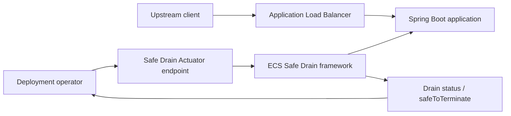
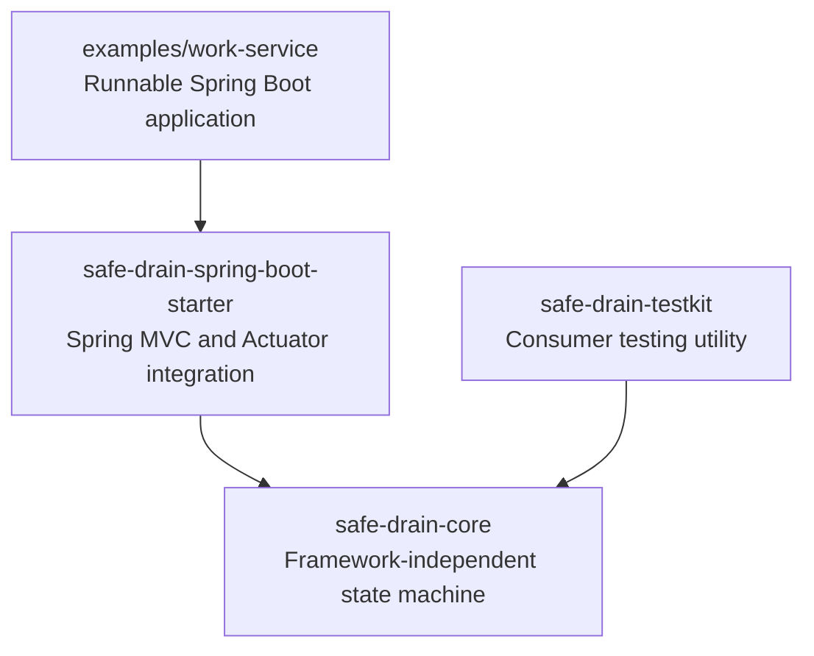
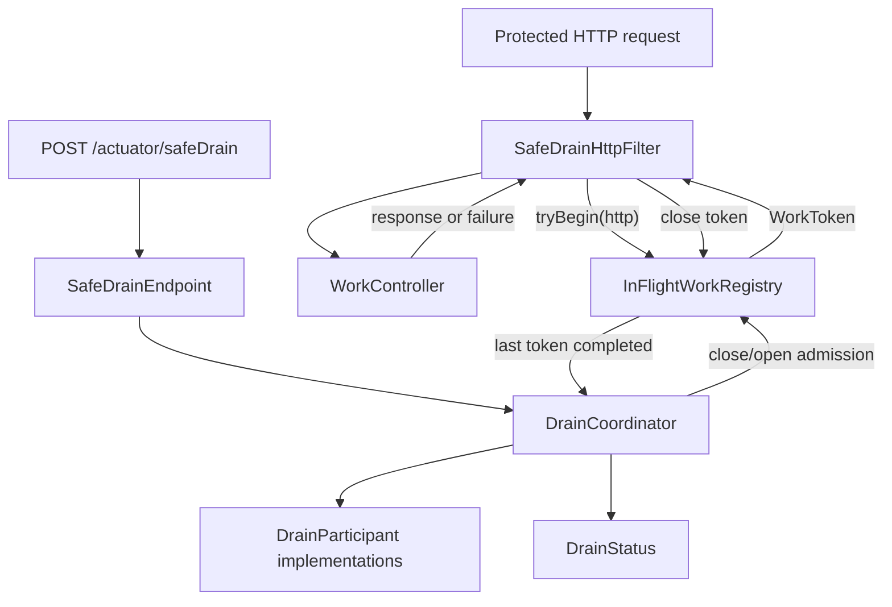
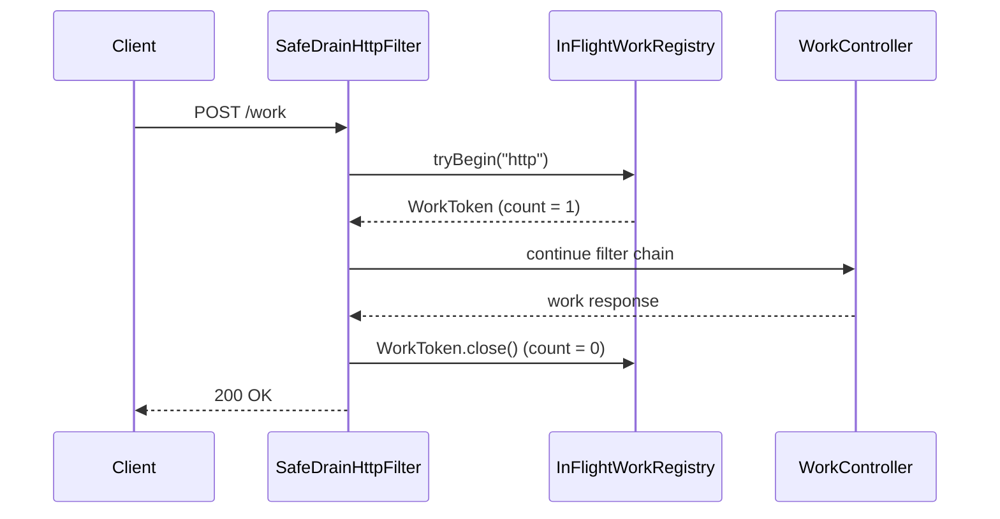
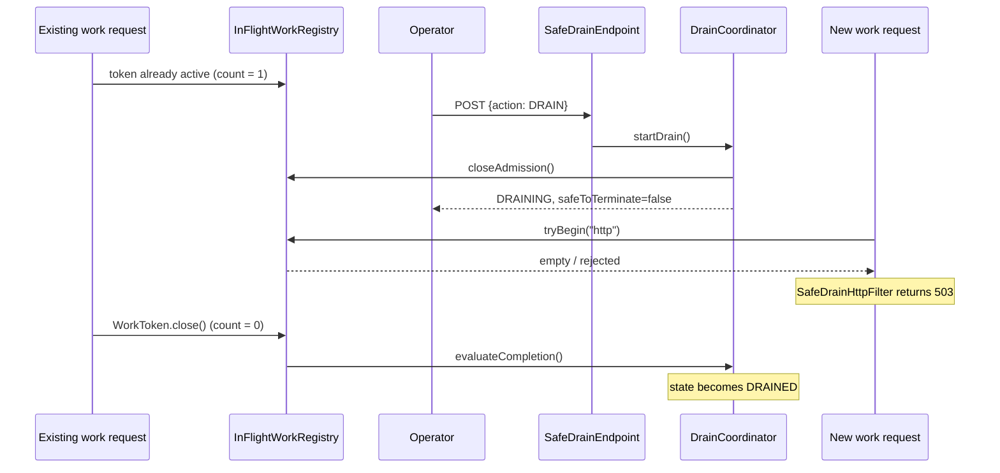
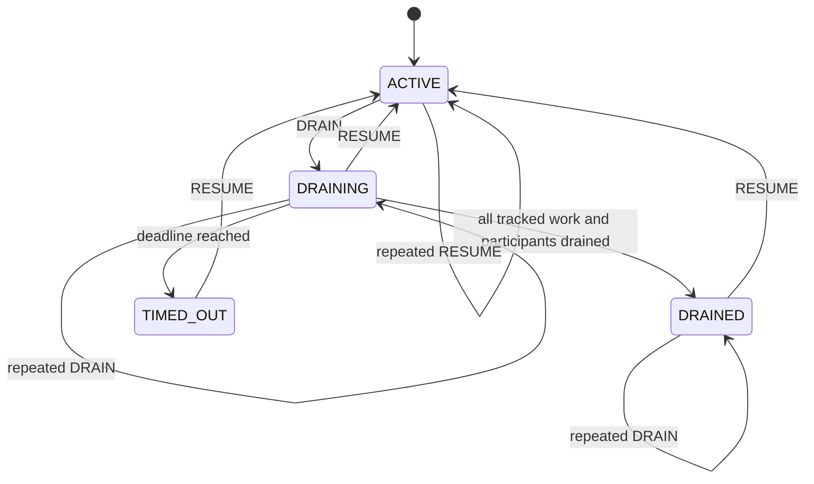

# Architecture

## System context

ECS Safe Drain runs inside each Spring Boot application instance. It does not deploy containers or move load-balancer traffic; ECS, CodeDeploy, and the load balancer remain responsible for those platform operations.

The framework answers one local question: **does this application process still have protected HTTP work that must finish before it is safe to terminate?**

## Module architecture

- `safe-drain-core` contains admission control, in-flight counting, lifecycle state, timeout handling, status snapshots, lifecycle events, and the participant SPI. It has no Spring dependency.
- `safe-drain-spring-boot-starter` discovers and configures the core, intercepts protected Servlet requests, and exposes management operations through Actuator.
- `safe-drain-testkit` gives framework consumers a deterministic participant for testing future workload adapters.
- `examples/work-service` is a generic demonstration application that imports the starter like an ordinary dependency.

## Runtime components

### Component responsibilities

- `InFlightWorkRegistry` owns the atomic boundary between admission and counting. A request is either admitted and counted or rejected; it cannot slip through while admission is closing.
- `WorkToken` represents ownership of one accepted operation and decrements its category exactly once when closed.
- `DrainCoordinator` owns state transitions, timestamps, the drain deadline, participant coordination, lifecycle events, and the `safeToTerminate` decision.
- `SafeDrainHttpFilter` applies configured path policy and owns each HTTP token until synchronous or asynchronous Servlet completion.
- `SafeDrainEndpoint` translates `DRAIN` and `RESUME` management commands into coordinator calls.
- `DrainParticipant` is the extension boundary for future workloads such as message consumers or scheduled jobs.

## Accepted request sequence

The registry tracks the Servlet request lifetime. The sample work-item map and its `PROCESSING` value are not inspected by the coordinator.

## Drain while a request is running

## Lifecycle

Both management commands are idempotent in their already-satisfied states. Repeated `DRAIN` during `DRAINING` or after `DRAINED` returns the existing snapshot. Repeated `RESUME` while `ACTIVE` returns the unchanged `ACTIVE` snapshot.

Resuming a drained task invalidates its earlier `safeToTerminate: true` result. Deployment tooling must therefore treat the newest status as authoritative.

## Thread safety

Registry acquisition and admission closure share one monitor. This prevents a request from observing open admission and incrementing after a drain has closed it. Each token uses an atomic closed flag, so duplicate Servlet completion callbacks cannot decrement twice.

The coordinator serializes state transitions, zero-work callbacks, timeout callbacks, participant snapshots, and resume operations with its lifecycle monitor. It schedules one timeout task and reacts to registry notifications instead of polling. Returned maps and lists are immutable copies.

## Participants and failures

Participants stop their own admission, report their safety condition, and resume when requested. Zero participants is valid. A participant failure while draining is recorded in `lastError` and prevents `DRAINED`. A participant status exception is represented as a non-drained `ParticipantDrainStatus`. A timeout changes the state to `TIMED_OUT` but never claims that termination is safe.

## Boundary with ECS

The current framework decides whether this process is safe to terminate. It does not request ECS task protection, change desired task count, receive deployment hooks, control ALB target registration, or prevent `SIGKILL`. An external deployment controller must stop routing new traffic, initiate drain early enough, observe the latest `safeToTerminate` value, and coordinate task termination.
